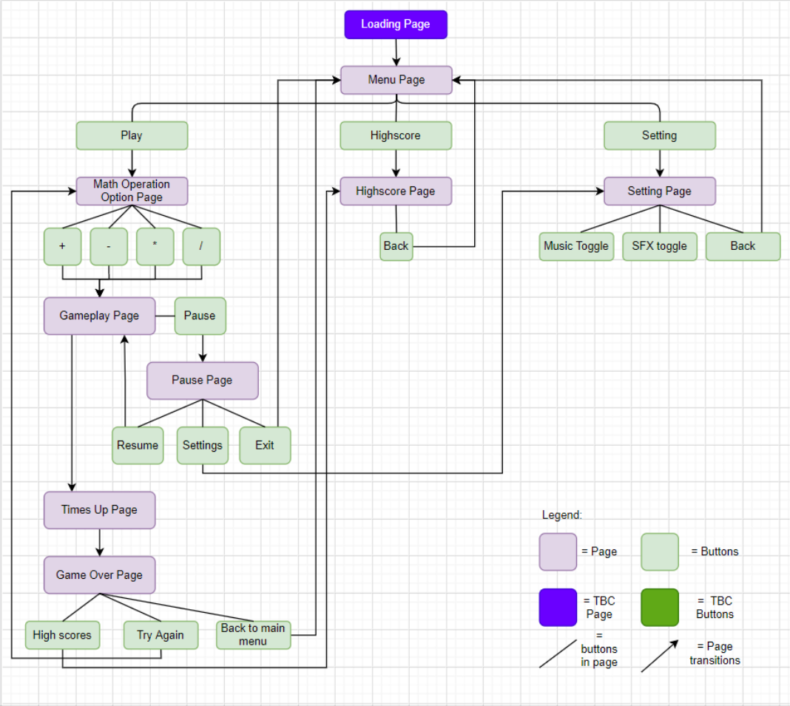
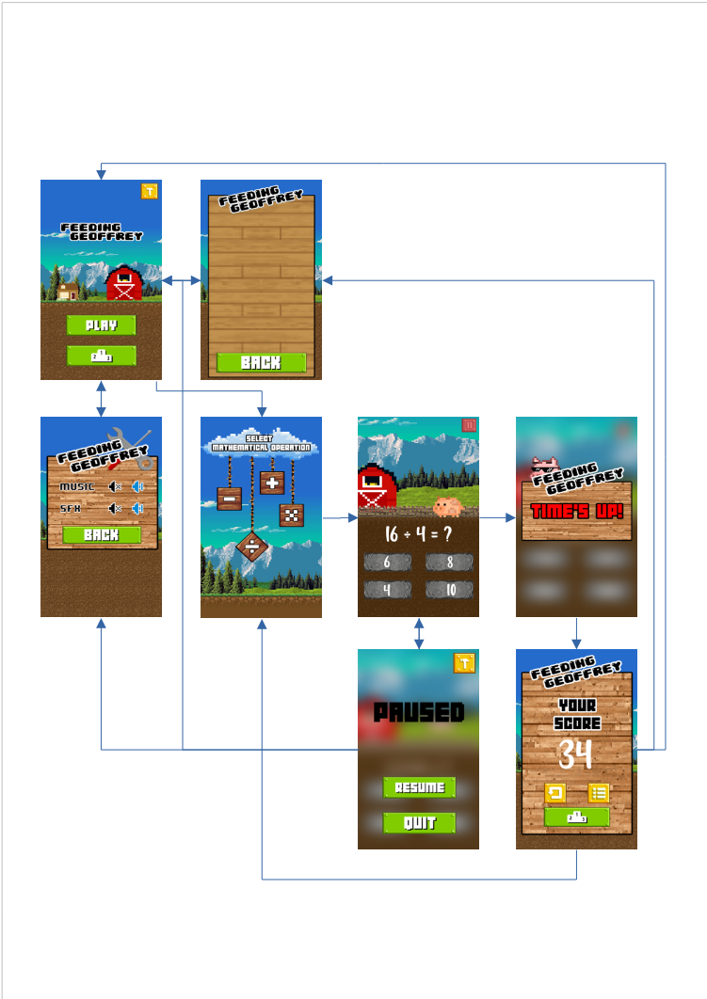
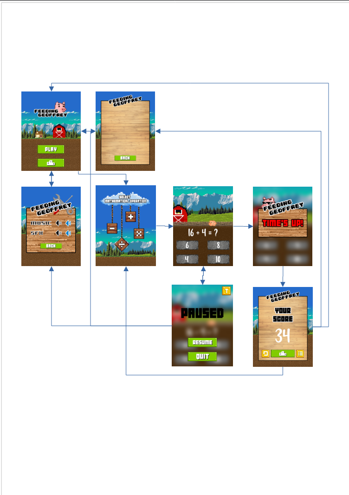

# A HTML5/CSS3 & Javascript based Project for Assignment 1
***

## **Context**
___
### _Opening Statement & Summary_
This assignment has required us, the programmers, to create a HTML/CSS & Javascript based website with interactive elements, while demonstrating the understanding of the Five Planes of UI/UX.

This project that I've created, within the set requirements, is essentially a fast paced mathematical quiz game with the aesthetic of a countryside farm. 

Targeted mainly at elementary level children that are already being introduced into the 4 main mathematical operators, the users will be challenged on their current skillset and knowleadge under pressure. This is intended to nurture their critical thinking and develop cognitive and logical skills that will further prepare them to fufill today's educational standards. This may also extend to the parents/guardian of the children that have a similar goal in mind.
___
### _Personal goals and expected user goals_
What I, as the programmer, hope to achieve is to provide a product that is intuitive and useful for both the child and their parents/guardian, to help improve and gauge their growing skill set

As the user, the goal is to use the product to improve their own skill set while retaining an interest and is able to rely on the product to provide noticable improvements, specifically in math.
***
## Demo
___
The live website can be access from this link:
### [Feeding Geoffrey](https://itsstillryan.github.io/FG-Assignment-01/)
***
## **Content**
___
### _Site Map_
#### Intended navigation for the game

### **Main Menu Page**
* Main logo
* Play button
* Highscores button
* Settings
### **Math Operators Page**
* Math Operators selector graphic holding
    * Addition
    * Subtraction
    * Multiplication
    * Division
### **Gameplay Page**
* Equation
* Multiple choice answers
* Pause button
    * Resume button
    * Quit button
    * Settings button
* Animated sprite
### **Highscore Page**
* Highscore board with
    * Addition
    * Subtraction
    * Multiplication
    * Division
* Back button
### **Setting Page**
* Music controls
* Back button
___
### _Mock Ups_
#### Creating a storyboard with graphics on what I initally envisioned the end product to be
##### Mobile View

##### Tablet View

##### Desktop View

___
