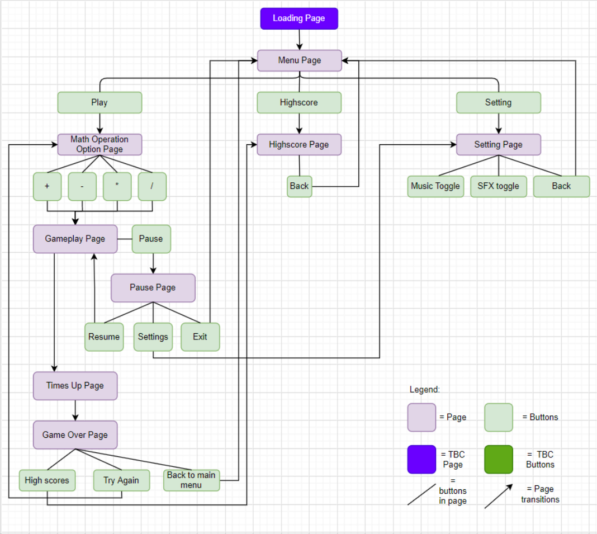
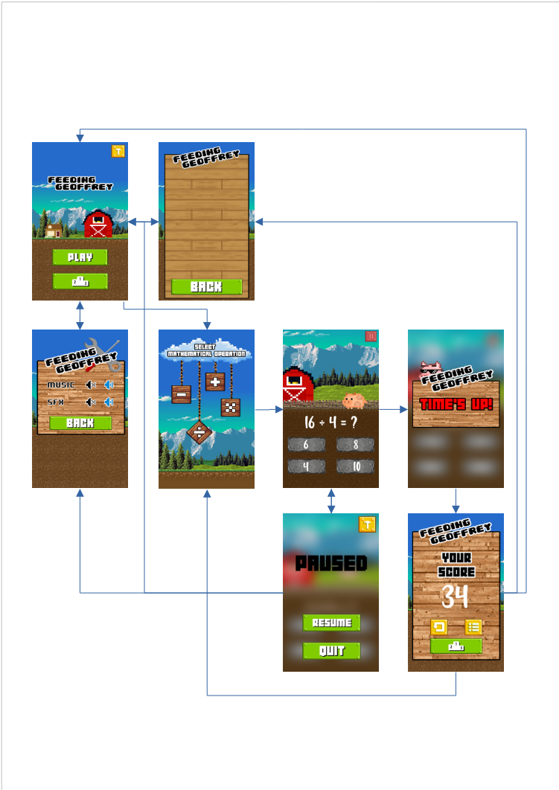
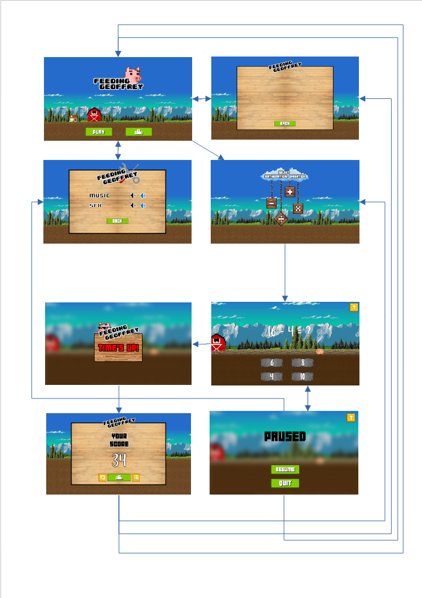

# A HTML5/CSS3 & Javascript based Project for Assignment 1
***

## **Context**
___
### _Opening Statement & Summary_
This assignment has required us, the programmers, to create a HTML/CSS & Javascript based website with interactive elements, while demonstrating the understanding of the Five Planes of UI/UX.

This project that I've created, within the set requirements, is essentially a fast paced mathematical quiz game with the aesthetic of a countryside farm. 

Targeted mainly at elementary level children that are already being introduced into the 4 main mathematical operators, the users will be challenged on their current skillset and knowleadge under pressure. This is intended to nurture their critical thinking and develop cognitive and logical skills that will further prepare them to fufill today's educational standards. This may also extend to the parents/guardian of the children that have a similar goal in mind.
___
### _Personal goals and expected user goals_
What I, as the programmer, hope to achieve is to provide a product that is intuitive and useful for both the child and their parents/guardian, to help improve and gauge their growing skill set

As the user, the goal is to use the product to improve their own skill set while retaining an interest and is able to rely on the product to provide noticable improvements, specifically in math.
***
## **Strategy**
___
### Users:
The direct users of this web application are elementary level children that are already being introduced into the 4 main mathematical operators. 

Indirectly, this can be used by parents and/or teachers to gauge their children/students on their current skill level with basic mathematics and can plan ahead on the acadamic schedule to cater for areas that may be lacking.

#### Goals:
Direct users goals are to use this web application to develop their critical thinking, cognitive and logical skills that will further prepare them to fufill today's educational standards.

Indirect users goals are to use this web application to aid them in teaching and guiding their children/students, veering away from traditional teaching methods to a more captivating and engaging method which ties in into the current era where children are familiar and exposed to mobile devices. 

### Owner's Goal:
Creating this web application to provide direct users a more engaging method to learn basic mathematics and to provide Indirect users a tool to aid them in teaching and gauging their teaching patterns and strategy.
***
## Demo
___
The live website can be access from this link:
### [Feeding Geoffrey](https://itsstillryan.github.io/FG-Assignment-01/)
***
## **Content**
___
### _Site Map_
#### Intended navigation for the game

### **Main Menu Page**
* Main logo
* Play button
* Highscores button
* Settings
### **Math Operators Page**
* Math Operators selector graphic holding
    * Addition
    * Subtraction
    * Multiplication
    * Division
### **Gameplay Page**
* Equation
* Multiple choice answers
* Pause button
    * Resume button
    * Quit button
    * Settings button
* Animated sprite
### **Highscore Page**
* Highscore board with
    * Addition
    * Subtraction
    * Multiplication
    * Division
* Back button
### **Setting Page**
* Music controls
* Back button
***
## Features
___
#### Main Menu
The first and main page the user sees upon enter the game. Using subtle fade ins of the logo and buttons, it provides some immersion into the setting and mood of the game, along with the autoplay music. 
#### Math Operator choices
Given the choice of either of the 4 main operators, each will take them to the respective gameplay screens. Layout placements achieved by using area map and seperate HTML files for each math operators.
#### Highscore
Taking the last scored highscore from each of the operators from Local Storage. Each highscore will be displayed infront of a scoreboard, beside each respective math operator
#### Setting
Provides a space to give users a control panel to control the music played. As well as a language swap with the choice of English or French.
#### Gameplay
Taking advantage of "display:" CSS, I am able to achieve seemless transitions between each screen
* Click to Start
    * This page provides a landing page to let users prepare before the game starts.
* Main Gameplay
    * All numbers of screen have been randomly generated by a math.random function call, the numbers generated in the equation is then being processed through the selected math operator, the answer to the equation is then held in local storage while another number generator generates a random placement for the answer to override the choices button.
    * Animations in this screen is all done using @Keyframes.   
* Times Up
    * Using setInterval, I was able to trigger this page after 62 seconds (2 seconds to offset the loading time, if any). This screen should only last 3 seconds.
* Game Over
    * This screen provides the user with their final highscore, along with buttons to replay the game, the highscore page, or back to the main menu.
#### Responsiveness
I have chosen 6 breakpoints for mobile responsiveness, 3 mobile sizes, 2 tablet sizes and a 1080p desktop screen size. As researched, these are the most common screen sizes and thus, it would make sense to cater to these specific sizes.
The screen sizes I cater for in this project:
 * Mobile Small - 375 x 667
 * Mobile Medium - 375 x 812
 * Mobile Large - 360 x 740
 * Tablet - 768 x 7024
 * Tablet Large(ipad pro) - 834 x 1112
 * Desktop - 1920 x 1080
#### Navigation
Since it will be a children's game, a simple navigation is key. All pages are within the "3 clicks" rule, all navigation buttons are clearly displayed.

***
## Mock Ups
___
#### _Creating a storyboard with graphics_
As I have chosen to do a game, I've decided that UI would take the highest priority. Setting aside the first week to decide and design the UI, I've preemptively layed out the skeleton structure with graphics with navigation arrows to properly envision the end product that I will be working towards to.

##### Mobile View

##### Tablet View

##### Desktop View

***

## UI and Design Choices
___
#### **Pixelated with bright colors. Unusual Protagonist.**

Since this will mainly cater to children, it would be wise to design something that catches the eye and the short attention span of a child, as well as designing something simple enough that it will be easily understood and percieved. 

Taking into account with current (Feburary 2021 as of when this is written) popular games with a younger age demographic; i.e: **Minecraft**, **Among Us**, **Roblox**. The games listed share similar UI designs, simple in a Pixelated style or in Primary shapes and bright with primary colors with slight deviations of them. With this in mind, I have adopted the Pixelated design as the main focus of the game. 

The Protagonist was decided in the spur of the moment when I came across the kids channel. The realization hit when I noticed most cartoons use animals as their Protagonist, mostly sentient ones. The idea then came to me as "What would be hilarious to see and have done in a game?" and it would be feeding a pig with a human name that grows exponentially when overfed.

#### **Color choices and Fonts**
The colors that I associate a farm with is earthy and green in the foreground, light and blue in the background. In this case, a darker earthy color would be fitting in the foregroud as it sets in a pig's pen. The colors chosen will be complementing and contrasting with green and brown.

Since it has been established that it will be a pixeltaed style design, font choices would narrow down to follow suit. Using either an 8bit or 16bit bubbly text
***

## Testing
___
### _Markup Validations_
HTML page validated using W3 validator
#### index.html
4 errors - missing alt tag on area map
No other significant errors
#### highscore.html
No significant errors alerted
#### Gameplay.html (all 4 included)
No significant errors alerted
___
### _Console.log Checks_
Axios check - "Database Active, Returning test value:"

Score check - Every time user clicks on the correct answer, "ScoreUp 1++"
***
## Technologies Used
___
As with the requirements of this project, it is done within the limits of **HTML5, CSS3 and Javascript**.
All coding has been done in **Gitpod** IDE, including a seperate repository as a testing workbench.

**I also employed the use of external frameworks such as:**

#### **Bootstrap** https://getbootstrap.com/

Most layout work in the game is using Bootstrap's easy to use Grid System, as well as thier nicely formatted button class

#### **Axios** https://github.com/axios/axios

Although this is a requirement, it deemed helpful and provided a simple solution to do a language toggle.

#### **imageMapResizer** https://github.com/davidjbradshaw/image-map-resizer
 
This fan made framework allowed me to use an imageMap without the worry and troubles of a misplaced coordiates as it allows automatic scaling in relation to the screen size.

#### **Anime.js** https://animejs.com/

I had intended to use Anime.js's extensive animation suite for animating all of my animations. Due to time constrants and steep learning curve, I have decided to forgo using this framework and used CSS's built in animations instead. But, I have full intentions of converting all animations to use Anime.js in the future.

**Tools involved during development:**

#### **Drawio** https://app.diagrams.net/
Using Drawio for my Site map

#### **Photoshop** https://www.photoshop.com/en
All graphics have been done photoshop

#### **REAPER** https://www.reaper.fm/
The Digital Audio Workstation(DAW) that allowed me to produce and composed the Main menu music

#### **FreeMusicArchive** https://www.freemusicarchive.org
Gameplay music was found here, all credits go to the composer and artist Lobo Loco. 

#### **DAFONT** https://www.dafont.com/
Fonts that are in the game was found and downloaded here

#### **Dirty Markup** https://www.10bestdesign.com/dirtymarkup/
Cleaning up codes 

#### **w3 Markup Validator** http://validator.w3.org/
Markup Validations
***

## Future development plans and Existing Bugs
___
### Animations

As I has mentioned in the section before, I have full intentions of porting all animations to use the anime.js framework. This will include more animations, especially in the Main menu page.

### Gameplay Logic

There is still a lot of room for improvements for the gameplay mechanics codes. Admittedly, it can be more streamlined and some of the core functions of the gameplay is just about relatively reliable. One thing for example is the catch for duplicate numbers in the option stones.

Another futher improvement I would make is the correct answer detection system and it working seemelessly with the +1 animation. Currently, there is a bug where by the second correct answer click won't trigger the +1 animation due to the array being undefined until the third click.

### Database storage

Instead of using the local browser storage, a more reliable database solution can be employed to provide a more reliable solution.
***
## Deployment
___
### Content
* Ensure all last changes are saved and committed 
* Successfully went through with a Git Push

### Activate Deployment
1. On GitHub, navigate to your site's repository.
2. Under your repository name, click Settings
3. Under "GitHub Pages", use the None or Branch drop-down menu and select a publishing source.
Drop-down menu to select a publishing source
4. Optionally, use the drop-down menu to select a folder for your publishing source. 
5. Click Save. 

***
## Credits
___
### Art
Main Background Layer of all screen - https://wallup.net/8-bit/

Dirt texture - https://pixeljoint.com/pixelart/66240.htm

Pixelated pig - https://pixelblock.tumblr.com/post/57434361584/a-pig-porcine-porkchop-producer-and-friendly

Drum stick morsel - https://www.gamedevmarket.net/asset/free-pixel-food/

### Fonts
Logo and main font - https://www.dafont.com/04b-30.font

Secondary font - https://www.dafont.com/8bit-wonder.font
### Music
Gameplay Music - https://www.freemusicarchive.org/music/Lobo_Loco/Not_my_Brain/country-boy-instrumental-id-1348

### Deployment steps 
Provided by Github Docs - https://docs.github.com/en/github/working-with-github-pages/configuring-a-publishing-source-for-your-github-pages-site
